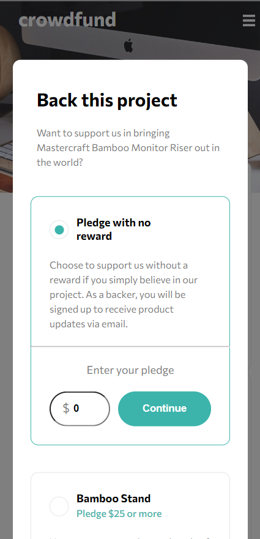

# Frontend Mentor - Crowdfunding product page solution

This is a solution to the [Crowdfunding product page challenge on Frontend Mentor](https://www.frontendmentor.io/challenges/crowdfunding-product-page-7uvcZe7ZR). Frontend Mentor challenges help you improve your coding skills by building realistic projects.

## Table of contents

-   [Overview](#overview)
    -   [The challenge](#the-challenge)
    -   [Screenshot](#screenshot)
    -   [Links](#links)
-   [My process](#my-process)
    -   [Built with](#built-with)
    -   [What I learned](#what-i-learned)
    -   [Continued development](#continued-development)
    -   [Useful resources](#useful-resources)
-   [Author](#author)

## Overview

### The challenge

Users should be able to:

-   View the optimal layout depending on their device's screen size
-   See hover states for interactive elements
-   Make a selection of which pledge to make
-   See an updated progress bar and total money raised based on their pledge total after confirming a pledge
-   See the number of total backers increment by one after confirming a pledge
-   Toggle whether or not the product is bookmarked

### Screenshot



Still working on the desktop version.

### Links

-   Solution URL: [Add solution URL here](https://your-solution-url.com)
-   Live Site URL: [Live Site](https://jp-fm-crowdfunding.netlify.app/)

## My process

### Built with

-   Semantic HTML5 markup
-   CSS custom properties
-   TypeScript
-   Flexbox
-   CSS Grid
-   Mobile-first workflow
-   [React](https://reactjs.org/) - JS library
-   [Styled Components](https://styled-components.com/) - For styles
-   [Vite](https://vitejs.dev/) - Frontend Tooling

### What I learned

Will update this later...

Use this section to recap over some of your major learnings while working through this project. Writing these out and providing code samples of areas you want to highlight is a great way to reinforce your own knowledge.

To see how you can add code snippets, see below:

```html
<h1>Some HTML code I'm proud of</h1>
```

```css
.proud-of-this-css {
	color: papayawhip;
}
```

```js
const proudOfThisFunc = () => {
	console.log('🎉');
};
```

If you want more help with writing markdown, we'd recommend checking out [The Markdown Guide](https://www.markdownguide.org/) to learn more.

### Continued development

I still need to tweak some layout issues when using the desktop version.

### Useful resources

-   [React: How to create a custom progress bar component in 5 minutes](https://dev.to/ramonak/react-how-to-create-a-custom-progress-bar-component-in-5-minutes-2lcl) - Really great and simple tutorial that helped me build the dynamic progress bar needed for the application.
-   [How to create a Modal Component in React from basic to advanced?](https://medium.com/tinyso/how-to-create-a-modal-component-in-react-from-basic-to-advanced-a3357a2a716a) - Another simple tutorial, this time on how to create a modal component in React.
-   Shoutout to [ChatGPT](https://chat.openai.com/) for helping me in all sorts of problems.

## Author

-   Website - [João P. Kiyoshi](https://joaopkiyoshi.netlify.app/)
-   Frontend Mentor - [@jpkiyoshi](https://www.frontendmentor.io/profile/jpkiyoshi)
-   Twitter - [@jpkiyoshi](https://twitter.com/jpkiyoshi)
